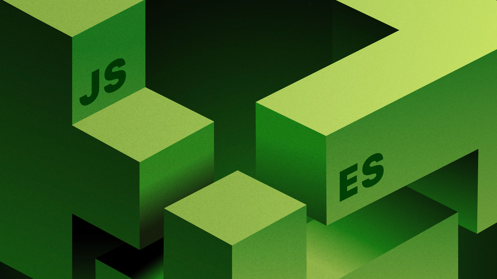

# 🌟 **Modern JavaScript Mastery Codebase**



---

## 🎯 **Project Overview**

Welcome to the **Modern JavaScript Mastery Codebase**—a dynamic, all-in-one playground designed to elevate your JavaScript expertise! This repo showcases a deep dive into cutting-edge concepts like **modular design**, **functional programming**, **immutability**, **closures**, and **asynchronous programming**. Built with **ES6+ standards**, it offers hands-on examples and real-world applications, making it ideal for developers aiming to craft scalable, maintainable, and high-performance applications—front-end or back-end alike.

Whether you're refining your skills or prepping for technical interviews, this codebase bridges theory and practice with zero dependencies, leveraging pure vanilla JavaScript to unlock its full potential.

---

## 📋 **Table of Contents**

- [Project Overview](#-project-overview)
- [Key Concepts Practiced](#-key-concepts-practiced)
- [Codebase Structure](#-codebase-structure)
- [Getting Started](#-getting-started)
- [Usage & Demonstrations](#-usage--demonstrations)
- [Best Practices](#-best-practices)
- [Tools & Libraries Used](#-tools--libraries-used)
- [Contributing](#-contributing)
- [License](#-license)

---

## 📚 **Key Concepts Practiced**

### 🌐 **Module System & ES6 Imports/Exports**

- **Modularity**: Named/default exports and imports for reusable, maintainable code.
- **Flexibility**: Renaming imports and namespace imports for dynamic composition.
- **Dependency Management**: Integration with npm and bundlers like Parcel.

### ⚙️ **Functional Programming & Immutable State**

- **Pure Functions**: Side-effect-free operations returning new state objects.
- **Declarative Transformations**: Mastery of `map`, `filter`, `reduce`, and spread operator.
- **State Protection**: `Object.freeze` to enforce immutability on constants.

### 🧬 **Deep and Shallow Copies**

- **Shallow Copying**: `Object.assign` for surface-level cloning.
- **Deep Cloning**: `lodash-es` `cloneDeep` for nested object immutability.
- **Complex Data**: Handling arrays and objects with multi-level structures.

### 🔒 **Closures & IIFE (Immediately Invoked Function Expressions)**

- **Encapsulation**: Private variables and data privacy via lexical scoping.
- **Public APIs**: Exposing controlled interfaces while hiding internals.
- **Lexical Scoping**: Deep understanding of closure behavior in JS.

### ⏳ **Asynchronous Programming with Async/Await**

- **Data Fetching**: `fetch` with `await` for seamless API integration.
- **Top-Level Await**: Synchronizing module execution flows.
- **Error Handling**: Robust async flows with try/catch and promise rejections.

### 🔥 **Hot Module Replacement (HMR)**

- **Live Updates**: Dynamic module swapping for enhanced developer workflows.
- **Efficiency**: Reduces reload times during development cycles.

### 🌍 **Practical API Integration**

- **External APIs**: Real-world data from `jsonplaceholder.typicode.com`.
- **Flow Control**: Managing async responses for dynamic UI updates.

---

## 📁 **Codebase Structure**

| File/Directory        | Description                                   | Key Focus                 |
| --------------------- | --------------------------------------------- | ------------------------- |
| `shoppingCart.js`     | Core cart logic with named/default exports.   | Modules, State Management |
| `functionalCode.js`   | Pure functions and immutable budget tracking. | Functional Programming    |
| `importingModules.js` | Demonstrates import patterns and usage.       | ES6 Imports               |
| `exportingModules.js` | Showcases export configurations.              | ES6 Exports               |
| `shoppingCart2/`      | Closure-based cart with IIFE for privacy.     | Closures, Encapsulation   |
| `cloneDeep/`          | Deep vs. shallow cloning with `lodash-es`.    | Immutability              |
| `asyncExamples/`      | Async/await and top-level await demos.        | Asynchronous Flow         |

_Note_: Folders like `asyncExamples` and `shoppingCart2` contain sub-files for detailed exploration (e.g., `fetchData.js`, `cartIIFE.js`).

---

## 🚀 **Getting Started**

1. **Clone the Repository**:

   ```
   git clone https://github.com/sheharyarr-ahmed/NovaScripts.git

   ```

2. **Install Dependencies**:

   ```
   npm install
   ```

3. **Run Locally**:

   - **Browser**: Open `index.html` with a live server (e.g., VS Code Live Server) for module support.
   - **Node.js**: Execute individual files with `node filename.js` (enable `--experimental-modules` for ES6).
   - Use browser DevTools or terminal logs to inspect outputs.

4. **Development Mode**:
   - Run `npm start` (with Parcel configured) for Hot Module Replacement.

---

## 🎮 **Usage & Demonstrations**

- **Modular Shopping Cart**: Import `shoppingCart.js` into `index.html` and test add/remove items.
- **Immutable Budget**: Modify `functionalCode.js` to track expenses and verify state immutability.
- **Closure Exploration**: Run `shoppingCart2/cartIIFE.js` to see private state in action.
- **Async Fetching**: Open `asyncExamples/fetchData.js` to fetch and log API data with await.
- **Deep Cloning**: Compare shallow vs. deep copies in `cloneDeep/cloneDemo.js` with nested objects.
- **HMR Demo**: Edit `index.html` scripts and watch live updates with Parcel.

Experiment by tweaking code—add new modules, integrate APIs, or simulate real-time data!

---

## 💡 **Best Practices**

Elevate your JS game with these proven techniques:

- **Modularize Early**: Break code into small, single-responsibility modules.
- **Enforce Immutability**: Use deep clones to avoid unintended mutations.
- **Handle Async Gracefully**: Always wrap `await` in try/catch blocks.
- **Leverage Closures**: Encapsulate state for security and readability.
- **Optimize Performance**: Prefer pure functions to minimize side effects.
- **Test Extensively**: Mock async calls and immutable states in unit tests.

---

## 🛠️ **Tools & Libraries Used**

- **JavaScript ES6+**: Core language features (modules, async/await, etc.).
- **npm**: Dependency and package management.
- **lodash-es**: Deep cloning utilities for immutability.
- **Parcel**: Bundler for HMR, module resolution, and dev workflows.
- **Browser DevTools**: Debugging async flows and state changes.

---

## 🤝 **Contributing**

Love this codebase? Fork it, add new modules (e.g., React integration or WebSocket async), and submit a pull request. Let’s build a community-driven JS masterpiece!

---

## 📜 **License**

This codebase reflects my personal learning journey and hands-on practice in modern JavaScript. It showcases the skills and practices I’m building as I work toward becoming a great full-stack developer. Free to use, modify, and distribute.

---
